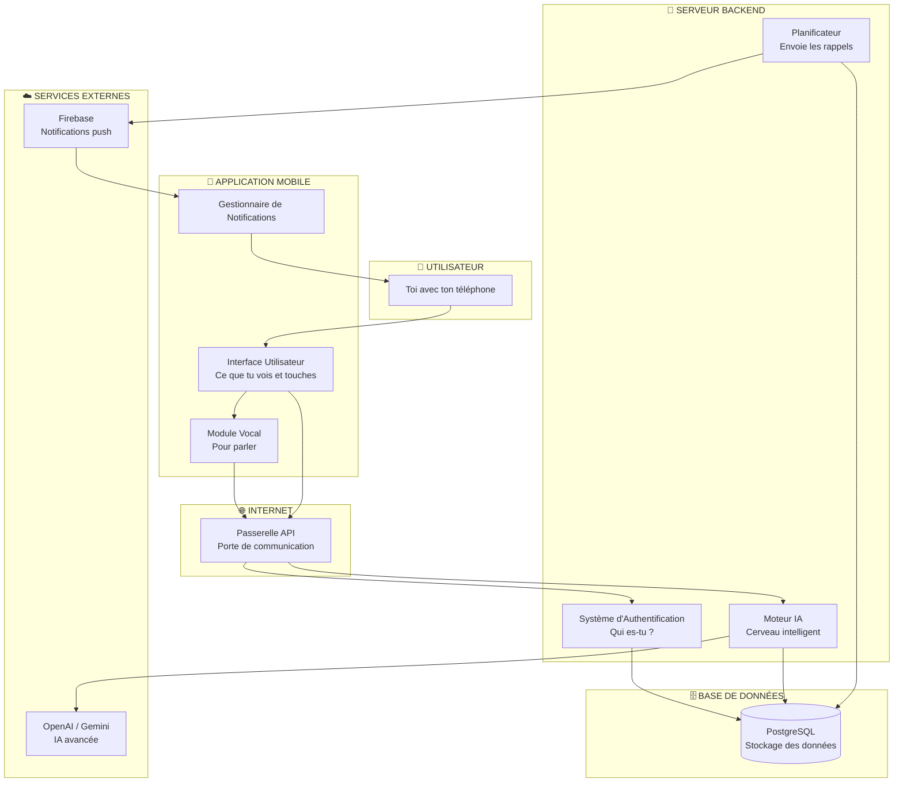
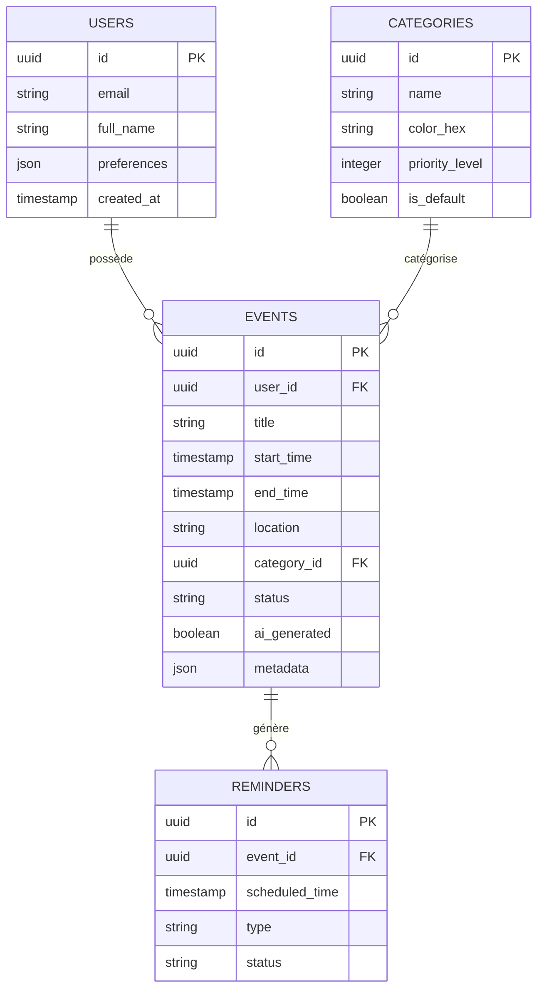

# 🏗️ Document Technique - SmartAgenda AI

## 📌 Introduction

Le **document technique** explique **comment** le projet fonctionne "sous le capot". C'est comme le **manuel de mécanique** d'une voiture qui montre comment le moteur fonctionne.

> 🎯 **Objectif** : Te faire comprendre l'architecture et les technologies utilisées, même si tu débutes en programmation.

---

## 🧩 1. Architecture Générale du Système

### 1.1 Les 3 Composants Principaux

Imagine SmartAgenda AI comme une **maison** :

```
🏠 LA MAISON SMARTAGENDA
├── 📱 Le Salon (Application Mobile) - Ce que tu vois
├── 🧠 La Cuisine (Serveur Backend) - Où les calculs se font
└── 🗄️ La Cave (Base de Données) - Où tout est stocké
```

## Architecture Visuelle



### 1.2 Comment Tout Communique ?

**Exemple concret** : Création d'un rendez-vous

```
1. 📱 TU DIS : "Rendez-vous dentiste demain 14h"
   └─> L'app mobile enregistre ta voix

2. 🌐 ENVOI AU SERVEUR via Internet
   └─> Les données partent de ton téléphone

3. 🧠 LE SERVEUR ANALYSE (Backend)
   ├─> Transforme la voix en texte
   ├─> L'IA comprend : Titre="Dentiste", Date="Demain", Heure="14h"
   └─> Vérifie s'il y a un conflit

4. 🗄️ STOCKAGE dans la base de données
   └─> Le rendez-vous est sauvegardé

5. 📱 CONFIRMATION sur ton téléphone
   └─> Tu vois le RDV apparaître dans ton calendrier
```

---

## 💻 2. Technologies Utilisées

### 2.1 Frontend (Application Mobile)

#### Flutter + Dart

**Flutter** est le framework (outil) utilisé pour créer l'application mobile.

**Pourquoi Flutter ?**
- ✅ Un seul code pour Android **ET** iOS (économie de temps !)
- ✅ Interface très fluide et belle
- ✅ Grande communauté d'aide en ligne

**Dart** est le langage de programmation utilisé par Flutter.

**Exemple de code Dart simple :**
```dart
// Créer un bouton pour ajouter un rendez-vous
ElevatedButton(
  onPressed: () {
    // Quand on clique, ouvrir le formulaire
    navigateToNewEvent();
  },
  child: Text("+ Nouveau Rendez-vous"),
)
```

**Packages Flutter Utilisés :**

| Package | Rôle | Pourquoi ? |
|---------|------|------------|
| `flutter_riverpod` | Gestion de l'état | Garde les données synchronisées |
| `dio` | Communication réseau | Parle au serveur backend |
| `supabase_flutter` | Base de données | Connexion à la BDD |
| `speech_to_text` | Reconnaissance vocale | Transforme ta voix en texte |
| `google_fonts` | Polices d'écriture | Rend l'app plus jolie |
| `flutter_animate` | Animations | Effets visuels fluides |

### 2.2 Backend (Serveur)

#### Python + FastAPI

**Python** est un langage de programmation très populaire et facile à apprendre.

**FastAPI** est un framework pour créer des serveurs web rapides.

**Pourquoi Python/FastAPI ?**
- ✅ Python est excellent pour l'Intelligence Artificielle
- ✅ FastAPI est très rapide
- ✅ Code facile à lire et à comprendre

**Exemple de code Python simple :**
```python
# Créer un endpoint (une porte d'entrée) pour récupérer les événements
@app.get("/api/v1/events")
async def get_events():
    # Récupérer tous les événements de la base de données
    events = database.get_all_events()
    return events  # Renvoyer la liste au téléphone
```

**Bibliothèques Python Utilisées :**

| Bibliothèque | Rôle |
|--------------|------|
| `fastapi` | Créer le serveur web |
| `uvicorn` | Faire tourner le serveur |
| `pydantic` | Valider les données |
| `supabase` | Connexion à la base de données |
| `langchain` | Travail avec l'IA |
| `openai` | IA avancée (GPT) |
| `google-generativeai` | IA Google (Gemini) |
| `apscheduler` | Planifier les rappels |

### 2.3 Base de Données

#### PostgreSQL via Supabase

**PostgreSQL** est un système de stockage de données très puissant.

**Supabase** est un service qui facilite l'utilisation de PostgreSQL.

**Analogie :** Imagine une **bibliothèque géante** où chaque livre est bien rangé :
- 📚 Table "users" = Étagère des utilisateurs
- 📚 Table "events" = Étagère des rendez-vous
- 📚 Table "categories" = Étagère des catégories

---

## 🗄️ 3. Structure de la Base de Données

### 3.1 Les Tables (Étagères)

#### Table `users` (Utilisateurs)

Stocke les informations sur chaque personne qui utilise l'app.

| Colonne | Type | Description | Exemple |
|---------|------|-------------|---------|
| `id` | UUID | Identifiant unique | `a1b2c3d4-...` |
| `email` | Texte | Adresse email | `jean@mail.com` |
| `full_name` | Texte | Nom complet | `Jean Dupont` |
| `preferences` | JSON | Préférences personnelles | `{"theme": "dark"}` |
| `created_at` | Date/Heure | Date d'inscription | `2024-01-15 10:30` |

#### Table `events` (Rendez-vous)

Stocke tous les rendez-vous de tous les utilisateurs.

| Colonne | Type | Description | Exemple |
|---------|------|-------------|---------|
| `id` | UUID | Identifiant unique | `x1y2z3...` |
| `user_id` | UUID | À qui appartient ce RDV ? | `a1b2c3d4-...` |
| `title` | Texte | Titre du rendez-vous | `Dentiste` |
| `start_time` | Date/Heure | Début | `2024-01-20 14:00` |
| `end_time` | Date/Heure | Fin | `2024-01-20 15:00` |
| `location` | Texte | Lieu | `Rue de la Paix, 10` |
| `category_id` | UUID | Catégorie | `santé-id...` |
| `status` | Texte | État | `confirmed` / `cancelled` |
| `ai_generated` | Booléen | Créé par l'IA ? | `true` / `false` |
| `metadata` | JSON | Infos supplémentaires | `{"notes": "Apporter carte"}` |

#### Table `categories` (Catégories)

Les différents types de rendez-vous.

| Colonne | Type | Description | Exemple |
|---------|------|-------------|---------|
| `id` | UUID | Identifiant | `cat-123...` |
| `name` | Texte | Nom de la catégorie | `Travail` |
| `color_hex` | Texte | Couleur (code hexadécimal) | `#4285F4` |
| `priority_level` | Nombre | Niveau de priorité (1-10) | `8` |
| `is_default` | Booléen | Catégorie par défaut ? | `true` |

**Catégories par défaut :**

| Nom | Couleur | Priorité |
|-----|---------|----------|
| Travail | 🔵 Bleu (#4285F4) | 8 |
| Personnel | 🟢 Vert (#34A853) | 5 |
| Santé | 🔴 Rouge (#EA4335) | 10 |
| Loisir | 🟡 Jaune (#FBBC05) | 3 |

### 3.2 Relations Entre les Tables



**Explication :**
- Un **utilisateur** peut avoir plusieurs **événements** (relation 1-à-plusieurs)
- Une **catégorie** peut être assignée à plusieurs **événements**
- Un **événement** peut avoir plusieurs **rappels**

---

## 🤖 4. Intelligence Artificielle

### 4.1 Comment l'IA Fonctionne ?

L'IA de SmartAgenda AI utilise **deux niveaux** :

#### Niveau 1 : Règles Simples (Sans IA Externe)

**Exemple :** Calcul de la priorité

```python
def calculate_priority(event):
    # Commencer avec le score de base de la catégorie
    score = event.category.priority_level * 10
    
    # Ajouter des bonus/malus
    if event.is_unique:  # Événement unique
        score += 10
    
    if event.cancellation_rate > 0.5:  # Souvent annulé
        score -= 15
    
    return score

# Exemple :
# Dentiste (Santé) = 10 * 10 = 100
# + Unique = +10
# → Score final = 110 (CRITIQUE)
```

#### Niveau 2 : IA Avancée (OpenAI / Google Gemini)

Utilisée pour :
- 🎤 **Reconnaissance vocale avancée** : Comprendre des phrases complexes
- 💬 **Génération de résumés** : Créer des briefings matinaux personnalisés
- 🔍 **Analyse de patterns** : Détecter tes habitudes

**Exemple de Requête IA :**

```python
# Envoyer une commande vocale à l'IA
user_command = "Décale mon RDV avec Marie à jeudi même heure"

# L'IA analyse et renvoie un JSON structuré
result = ai.parse_command(user_command)

# Résultat :
# {
#   "action": "reschedule",
#   "event_identifier": "Marie",
#   "new_date": "jeudi prochain",
#   "new_time": "conserver l'heure actuelle"
# }
```

### 4.2 Algorithme de Détection de Conflits

**Logique de détection :**

```python
def detect_conflict(new_event, existing_events):
    for existing in existing_events:
        # Vérifier si les horaires se chevauchent
        if (new_event.start_time < existing.end_time and 
            existing.start_time < new_event.end_time):
            
            # Conflit détecté !
            return {
                "has_conflict": True,
                "conflicting_event": existing,
                "suggestion": propose_alternative_slots()
            }
    
    return {"has_conflict": False}
```

**Visualisation :**

```
Ligne de temps :
───────────────────────────────────►
     10h      11h      12h      13h
     
Événement A :  [████████]  (10h-12h)
Nouvel Event : [████████]  (11h-13h)
               
               ^^^^  ← CONFLIT ICI !
```

### 4.3 Système de Notifications Intelligent

**Calcul du moment optimal de rappel :**

```python
def calculate_reminder_time(event):
    # Temps de trajet (via Google Maps API ou valeur par défaut)
    travel_time = get_travel_time(user_location, event.location) or 30  # minutes
    
    # Temps de préparation selon le type
    prep_time = {
        "santé": 15,
        "travail": 20,
        "soirée": 45,
        "default": 15
    }.get(event.category, 15)
    
    # Marge de sécurité
    buffer = 10
    
    # Calcul final
    total_minutes = travel_time + prep_time + buffer
    reminder_time = event.start_time - timedelta(minutes=total_minutes)
    
    # Règle anti-spam : Pas de notif entre 23h et 7h
    if reminder_time.hour < 7 or reminder_time.hour >= 23:
        reminder_time = reminder_time.replace(hour=7, minute=0)
    
    return reminder_time
```

**Exemple de calcul :**
```
RDV Dentiste : 14h00
Trajet estimé : 30 min
Préparation : 15 min
Marge sécurité : 10 min
─────────────────────
Total : 55 minutes avant
→ Rappel à 13h05
```

---

## 🔐 5. Sécurité et Authentification

### 5.1 Comment on Protège les Données ?

#### Authentification JWT (JSON Web Token)

**Analogie :** Imagine un **bracelet VIP** dans un festival :
- 🎫 Quand tu te connectes, le serveur te donne un "bracelet" (token)
- 🚪 Ce bracelet te permet d'accéder à tes données
- ⏰ Le bracelet expire après quelques heures (sécurité)

**Flux d'authentification :**

```
1. 📱 TU ENTRES tes identifiants (email + mot de passe)
   └─> Envoyé au serveur

2. 🧠 LE SERVEUR vérifie
   └─> Correct ? → Crée un TOKEN

3. 📱 TON TÉLÉPHONE reçoit et stocke le token
   └─> Utilisé pour toutes les prochaines requêtes

4. 🔄 Pour chaque action, le token est envoyé
   └─> Le serveur vérifie : "C'est bien toi ?"
```

#### Row Level Security (RLS)

**Principe :** Chaque utilisateur ne voit **QUE** ses propres données.

```sql
-- Règle de sécurité dans la base de données
CREATE POLICY "Users see only their events"
ON events
FOR ALL
USING (user_id = auth.uid());  -- auth.uid() = ton identifiant
```

**Résultat :** Même si quelqu'un vole le token, il ne peut accéder qu'à **SES** données.

### 5.2 Chiffrement des Données

- 🔐 **En transit** : Les données voyagent en HTTPS (cryptées)
- 🔐 **Au repos** : Les données dans la base de données sont cryptées

---

## 🌐 6. Communication API (Comment Tout Parle ?)

### 6.1 Qu'est-ce qu'une API ?

**API** = **A**pplication **P**rogramming **I**nterface

**Analogie :** L'API est comme un **serveur dans un restaurant** :
- 📱 **Toi (client)** : Tu passes une commande
- 🍽️ **Serveur (API)** : Il transmet ta demande en cuisine
- 🧠 **Cuisine (Backend)** : Elle prépare le plat
- 🍽️ **Serveur** : Il te rapporte le plat
- 📱 **Toi** : Tu reçois ta commande !

### 6.2 Endpoints Principaux

Un **endpoint** est une "porte d'entrée" pour une action spécifique.

| Méthode HTTP | Endpoint | Action | Exemple |
|--------------|----------|--------|---------|
| `GET` | `/api/v1/events` | Récupérer tous les RDV | Afficher le calendrier |
| `POST` | `/api/v1/events` | Créer un nouveau RDV | Ajouter "Dentiste 14h" |
| `PUT` | `/api/v1/events/{id}` | Modifier un RDV | Changer l'heure |
| `DELETE` | `/api/v1/events/{id}` | Supprimer un RDV | Annuler le dentiste |
| `POST` | `/api/v1/voice/parse` | Analyser une commande vocale | "RDV demain 10h" |
| `GET` | `/api/v1/categories` | Liste des catégories | Travail, Santé, etc. |

### 6.3 Exemple de Requête/Réponse

**Requête** (depuis l'app mobile) :
```json
POST /api/v1/events
{
  "title": "Rendez-vous dentiste",
  "start_time": "2024-01-20T14:00:00",
  "end_time": "2024-01-20T15:00:00",
  "category_id": "health-uuid-123",
  "location": "Rue de la Paix, 10"
}
```

**Réponse** (depuis le serveur) :
```json
{
  "success": true,
  "event": {
    "id": "event-uuid-456",
    "title": "Rendez-vous dentiste",
    "start_time": "2024-01-20T14:00:00",
    "end_time": "2024-01-20T15:00:00",
    "priority_score": 90,
    "reminder_time": "2024-01-20T13:05:00"
  },
  "message": "Rendez-vous créé avec succès ! Rappel programmé à 13h05."
}
```

---

## 📦 7. Déploiement (Comment Mettre en Production ?)

### 7.1 Docker (Conteneurisation)

**Docker** permet de "mettre l'application dans une boîte" qui fonctionne partout.

**Analogie :** C'est comme un **conteneur de transport** :
- 📦 Tout est à l'intérieur (code, dépendances)
- 🚢 Le conteneur peut aller n'importe où
- 🔄 Fonctionne de la même manière partout

**Fichier `docker-compose.yml` :**
```yaml
version: '3.8'

services:
  backend:
    build: ./backend
    container_name: smartagenda_backend
    ports:
      - "8001:8000"  # Port 8001 sur ta machine → Port 8000 dans le conteneur
    environment:
      - DATABASE_URL=...
    restart: always
```

### 7.2 Infrastructure Cloud

**Où tout tourne :**

```
☁️ CLOUD (Internet)
├── 🖥️ Serveur Backend (Heroku / Railway / DigitalOcean)
├── 🗄️ Base de Données (Supabase Cloud)
└── 🔔 Notifications (Firebase Cloud Messaging)
```

### 7.3 CI/CD (Déploiement Automatique)

**GitHub Actions** automatise les tests et le déploiement.

**Workflow :**
```
1. 💾 TU POUSSES du code sur GitHub
   └─> Déclenche automatiquement

2. ✅ TESTS automatiques
   └─> Vérifie que tout fonctionne

3. 🏗️ COMPILATION de l'app mobile
   └─> Crée le fichier .apk (Android)

4. 🚀 DÉPLOIEMENT automatique
   └─> Met à jour le serveur
```

---

## 📊 8. Performances et Optimisations

### 8.1 Objectifs de Performance

| Critère | Cible | Comment l'atteindre ? |
|---------|-------|-----------------------|
| **Temps de chargement** | < 2s | Cache local, optimisation des images |
| **Temps de réponse API** | < 500ms | Index sur la BDD, requêtes optimisées |
| **Consommation batterie** | < 5%/jour | Limiter les synchro fond, notifications optimisées |
| **Taille de l'app** | < 50 MB | Compression des assets, code tree-shaking |

### 8.2 Stratégies d'Optimisation

#### Cache Local
Les rendez-vous récents sont stockés sur le téléphone pour un accès ultra-rapide.

#### Requêtes Optimisées
```sql
-- Mauvaise requête (lente)
SELECT * FROM events WHERE user_id = 'xxx';

-- Bonne requête (rapide grâce à l'index)
SELECT id, title, start_time, category_id 
FROM events 
WHERE user_id = 'xxx' AND start_time >= NOW()
ORDER BY start_time LIMIT 50;
```

---

## 🧪 9. Tests et Qualité du Code

### 9.1 Types de Tests

| Type | Quoi ? | Exemple |
|------|--------|---------|
| **Tests Unitaires** | Teste une fonction isolée | "La fonction `calculate_priority` retourne bien 90 pour Santé ?" |
| **Tests d'Intégration** | Teste plusieurs parties ensemble | "Créer un RDV met bien à jour la BDD ?" |
| **Tests E2E** | Teste le parcours complet | "Créer un RDV par voix → Voir rappel" |

### 9.2 Exemple de Test Simple

```dart
// Test unitaire en Dart
test('Calculate priority for health event', () {
  final event = Event(
    title: 'Dentist',
    category: Category(name: 'Health', basePriority: 90),
    isUnique: true
  );
  
  final priority = calculatePriority(event);
  
  expect(priority, equals(100)); // 90 + 10 (unique) = 100
});
```

---

## 📝 10. Documentation du Code

### 10.1 Commentaires Utiles

**Mauvais commentaire :**
```python
# Créer un événement
def create_event():
    ...
```

**Bon commentaire :**
```python
def create_event(data):
    """
    Crée un nouvel événement dans la base de données.
    
    Cette fonction :
    1. Valide les données reçues
    2. Vérifie les conflits potentiels
    3. Calcule la priorité automatiquement
    4. Génère les rappels intelligents
    
    Args:
        data (dict): Données du RDV {title, start_time, end_time, category_id}
    
    Returns:
        Event: L'événement créé avec son ID
    
    Raises:
        ConflictError: Si un conflit est détecté et non résolu
    """
    ...
```

---

## 🔧 11. Outils de Développement

### 11.1 Environnement de Développement

| Outil | Rôle |
|-------|------|
| **VS Code** | Éditeur de code principal |
| **Android Studio** | Émulateur Android et SDK |
| **Postman** | Tester les API |
| **Git** | Versionning du code |
| **GitHub** | Hébergement du code |

### 11.2 Structure des Dossiers

```
SmartAgenda/
│
├── mobile/                    # Application Flutter
│   ├── lib/
│   │   ├── features/         # Fonctionnalités par écran
│   │   │   ├── auth/        # Authentification
│   │   │   ├── events/      # Gestion des RDV
│   │   │   └── voice/       # Commande vocale
│   │   ├── core/            # Composants partagés
│   │   └── main.dart        # Point d'entrée
│   ├── pubspec.yaml         # Dépendances Flutter
│   └── android/             # Configuration Android
│
├── backend/                  # Serveur Python
│   ├── app/
│   │   ├── api/             # Endpoints API
│   │   ├── services/        # Logique métier
│   │   ├── schemas/         # Validation des données
│   │   └── main.py          # Point d'entrée
│   ├── requirements.txt     # Dépendances Python
│   └── Dockerfile           # Configuration Docker
│
└── docs/                     # Documentation
    ├── product_specs.md
    ├── technical_architecture.md
    └── ai_logic.md
```

---

## 🎓 Conclusion Technique

### Points Clés à Retenir

1. **Architecture 3-tiers** : Mobile (Vue) + Backend (Logique) + BDD (Stockage)
2. **Technologies modernes** : Flutter, Python/FastAPI, PostgreSQL
3. **Sécurité première** : JWT, RLS, chiffrement
4. **IA à deux niveaux** : Règles simples + IA avancée (OpenAI/Gemini)
5. **Communication via API REST** : JSON sur HTTPS

### Pour Aller Plus Loin

Si tu veux approfondir certaines parties :
- 📘 **Flutter** : flutter.dev/docs
- 📗 **FastAPI** : fastapi.tiangolo.com
- 📙 **PostgreSQL** : postgresql.org/docs
- 📕 **Docker** : docs.docker.com

---

## 💬 Glossaire Technique

| Terme | Définition Simple |
|-------|-------------------|
| **API** | Interface pour faire communiquer des programmes |
| **Backend** | Partie serveur invisible (calculs, BDD) |
| **Frontend** | Partie visible (interface utilisateur) |
| **Token** | Jeton de sécurité prouvant ton identité |
| **UUID** | Identifiant unique universel |
| **JSON** | Format de données structurées {clé: valeur} |
| **HTTPS** | Protocole sécurisé pour Internet |
| **Docker** | Outil de conteneurisation d'applications |
| **CI/CD** | Déploiement automatique continu |
| **Cache** | Mémoire temporaire pour accès rapide |
