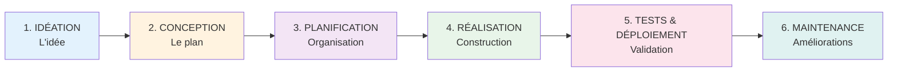

# 🎯 Guide Méthodologique - Comment Créer un Projet Informatique

## 📌 Introduction

Ce document explique **étape par étape** comment on crée un projet informatique du début à la fin. C'est la **méthodologie** (= la méthode de travail) que tous les développeurs professionnels utilisent.

> 💡 **Important** : Même si c'est l'IA qui a écrit le code pour toi, comprendre COMMENT un projet se construit est essentiel pour ta présentation scolaire et ta compréhension générale.

---

## 🌟 Vue d'Ensemble : Les 5 Grandes Phases



**Durée Typique (Projet SmartAgenda) :**
- Phase 1 : 1 semaine
- Phase 2 : 2 semaines
- Phase 3 : 1 semaine
- Phase 4 : 8 semaines
- Phase 5 : 2 semaines
- **TOTAL : ~3 mois**

---

## 💡 PHASE 1 : IDÉATION (L'Idée de Départ)

### 📖 Qu'est-ce que c'est ?

L'**idéation**, c'est le moment où on trouve et définit l'idée du projet.

### 🎯 Objectifs de cette Phase

- ✅ Identifier un **problème** à résoudre
- ✅ Imaginer une **solution** (l'application)
- ✅ Vérifier que c'est **réalisable**
- ✅ Définir les **utilisateurs** cibles

### 🛠️ Comment Faire ?

#### Étape 1.1 : Identifier le Problème

**Question à se poser :**  
*"Quel problème dans la vie quotidienne veux-je résoudre ?"*

**Exemple pour SmartAgenda :**
```
PROBLÈME IDENTIFIÉ :
  "Les gens oublient souvent leurs rendez-vous importants
   et ont du mal à gérer leur temps efficacement"

CAUSES :
  - Trop de choses à retenir
  - Manque de rappels au bon moment
  - Difficulté à détecter les conflits d'horaires
  - Stress de la planification
```

#### Étape 1.2 : Imaginer la Solution

**Brainstorming** (Réflexion libre) :
```
IDÉES DE SOLUTIONS :

❌ Solution 1 : Papier et stylo
   → Problème : Pas de rappel automatique

❌ Solution 2 : Agenda papier
   → Problème : Pas intelligent, pas de détection de conflits

✅ Solution 3 : Application mobile intelligente
   → Avantages :
      - Rappels automatiques
      - Intelligence artificielle
      - Toujours dans la poche
      - Détection de conflits
```

#### Étape 1.3 : Définir les Utilisateurs

**Créer des "Personas"** (Utilisateurs Fictifs) :

```
PERSONA 1 : Étudiant Marc, 18 ans
  Besoins :
    - Gérer cours et devoirs
    - Notifications discrètes en classe
    - Rappels pour révisions
  
  Frustrations :
    - Oublie souvent les deadlines
    - Difficile d'organiser son temps

PERSONA 2 : Professionnelle Sarah, 35 ans
  Besoins :
    - Gérer réunions clients
    - Bloquer du temps de concentration
    - Équilibrer vie pro/perso
  
  Frustrations :
    - Trop de réunions
    - Burnout professionnel
```

#### Étape 1.4 : Vérifier la Faisabilité

**Questions à se poser :**

| Question | Réponse pour SmartAgenda |
|----------|--------------------------|
| **Technique** : Peut-on le construire ? | ✅ Oui (Flutter + Python existent) |
| **Temps** : Combien de temps ? | ✅ 3 mois pour MVP (faisable) |
| **Ressources** : Quels outils ? | ✅ Outils gratuits disponibles |
| **Compétences** : Sais-je le faire ? | ⚠️ Non, mais l'IA peut aider |
| **Coût** : Combien ça coûte ? | ✅ ~60€/mois (abordable) |

### 📄 Livrable de la Phase 1

**Document à créer :**  
`Pitch du Projet` (1-2 pages)

Contenu :
```
PITCH SMARTAGENDA AI

Problème :
  Les gens oublient leurs RDV et gèrent mal leur temps

Solution :
  Application mobile avec IA pour gestion intelligente

Public Cible :
  - Étudiants
  - Professionnels
  - Familles

Avantage Concurrentiel :
  - Commande vocale naturelle
  - Détection automatique des conflits
  - Protection anti-burnout

Faisabilité : ✅ Réalisable en 3 mois
```

---

## 🏗️ PHASE 2 : CONCEPTION (Le Plan Détaillé)

### 📖 Qu'est-ce que c'est ?

La **conception**, c'est dessiner/planifier l'application **AVANT** de coder. C'est comme faire les plans d'une maison avant de la construire.

### 🎯 Objectifs de cette Phase

- ✅ Lister **toutes les fonctionnalités**
- ✅ Dessiner l'**interface utilisateur** (UI)
- ✅ Définir l'**architecture technique**
- ✅ Créer le **cahier des charges**

### 🛠️ Comment Faire ?

#### Étape 2.1 : Lister les Fonctionnalités

**Méthode MoSCoW** (Priorisation) :

| Priorité | Nom | Signification | Exemples SmartAgenda |
|----------|-----|---------------|----------------------|
| **M** | Must Have | **OBLIGATOIRE** | CRUD rendez-vous, Notifications |
| **S** | Should Have | **Très important** | Commande vocale, Détection conflits |
| **C** | Could Have | **Souhaitable** | Rapports hebdo, Chronobiologie |
| **W** | Won't Have | **Pas pour cette version** | Sync multi-appareils, Autres langues |

**Liste pour SmartAgenda :**
```
MUST HAVE (MVP) :
  ✅ Créer/Modifier/Supprimer RDV
  ✅ Voir calendrier (jour/semaine)
  ✅ Notifications intelligentes
  ✅ Catégorisation (Travail, Santé, etc.)

SHOULD HAVE :
  ✅ Commande vocale
  ✅ Détection de conflits
  ✅ Mode Freeze
  ✅ Système de priorités

COULD HAVE :
  ◻️ Rapports hebdomadaires
  ◻️ Anti-burnout
  ◻️ Smart Booking

WON'T HAVE (Version 1) :
  ❌ Synchronisation tablette/ordinateur
  ❌ Partage de calendrier familial
  ❌ Support multilingue
```

#### Étape 2.2 : Dessiner l'Interface (Maquettes)

**Outils de Maquettage :**
- Figma (gratuit, en ligne)
- Adobe XD
- Papier/Crayon (simple et rapide !)

**Exemple de Maquette Papier :**

```
┌─────────────────────────┐
│  SmartAgenda AI  [☰]   │  ← Header avec menu
├─────────────────────────┤
│ ☀️ Lundi 20 Janvier     │  ← Date du jour
├─────────────────────────┤
│  08:00 ─────────────    │
│  09:00 ┃████████┃       │  ← RDV (bloc coloré)
│        ┃Réunion ┃       │
│  10:00 ┃équipe  ┃       │
│  11:00 ─────────────    │
│  12:00 ─────────────    │
│  13:00 ─────────────    │
│  14:00 ┃████████┃       │
│        ┃Dentiste┃       │
│  15:00 ─────────────    │
├─────────────────────────┤
│      [+] Nouveau RDV    │  ← Bouton ajout
└─────────────────────────┘
```

**Écrans à Maquetter :**
1. Écran d'accueil (Timeline)
2. Formulaire création RDV
3. Vue calendrier semaine
4. Paramètres
5. Écran de détection de conflit

#### Étape 2.3 : Définir l'Architecture Technique

**Schéma à 3 Niveaux :**

```
┌─────────────────────────────────────┐
│   FRONTEND (Application Mobile)     │  ← Ce que l'utilisateur voit
│   Flutter + Dart                    │
└──────────────┬──────────────────────┘
               │ API (Internet)
┌──────────────▼──────────────────────┐
│   BACKEND (Serveur)                 │  ← La logique et l'IA
│   Python + FastAPI                  │
└──────────────┬──────────────────────┘
               │ SQL
┌──────────────▼──────────────────────┐
│   DATABASE (Base de Données)        │  ← Le stockage
│   PostgreSQL via Supabase           │
└─────────────────────────────────────┘
```

**Choix Techniques à Justifier :**

| Composant | Technologie Choisie | Pourquoi ? |
|-----------|---------------------|------------|
| **Mobile** | Flutter | Code unique iOS + Android |
| **Backend** | Python/FastAPI | Excellent pour l'IA |
| **BDD** | PostgreSQL | Puissant et gratuit (Supabase) |
| **IA** | OpenAI API | Meilleur en reconnaissance naturelle |
| **Notifications** | Firebase | Standard industrie |

#### Étape 2.4 : Créer la Base de Données (Schéma)

**Tables à Définir :**

```sql
-- Table des Utilisateurs
users (
  id,           -- Identifiant unique
  email,        -- Email
  full_name,    -- Nom complet
  preferences   -- Préférences (JSON)
)

-- Table des Rendez-vous
events (
  id,            -- Identifiant unique
  user_id,       -- À qui appartient le RDV ?
  title,         -- Titre
  start_time,    -- Début
  end_time,      -- Fin
  category_id,   -- Catégorie
  location,      -- Lieu
  status         -- État (confirmé/annulé)
)

-- Table des Catégories
categories (
  id,
  name,          -- Nom (Travail, Santé, etc.)
  color_hex,     -- Couleur
  priority_level -- Niveau de priorité (1-10)
)
```

**Relations :**
- 1 utilisateur peut avoir plusieurs rendez-vous (1-n)
- 1 catégorie peut être utilisée pour plusieurs rendez-vous (1-n)

### 📄 Livrables de la Phase 2

**Documents à créer :**

1. ✅ **Cahier des charges** (product_specs.md)
   - Fonctionnalités détaillées
   - Flux utilisateurs
   
2. ✅ **Architecture technique** (technical_architecture.md)
   - Schémas systèmes
   - Choix technologiques
   
3. ✅ **Maquettes UI/UX** (wireframes)
   - Dessins de tous les écrans
   
4. ✅ **Schéma de base de données** (database_schema.sql)
   - Structure des tables

---

## 📅 PHASE 3 : PLANIFICATION (Organisation du Travail)

### 📖 Qu'est-ce que c'est ?

La **planification**, c'est découper le projet en petites tâches et organiser le calendrier de travail.

### 🎯 Objectifs de cette Phase

- ✅ Décomposer en **tâches réalisables**
- ✅ Estimer le **temps** pour chaque tâche
- ✅ Créer un **planning** (Roadmap)
- ✅ Identifier les **risques**

### 🛠️ Comment Faire ?

#### Étape 3.1 : Décomposer en Tâches

**Méthode WBS** (Work Breakdown Structure) :

```
PROJET SMARTAGENDA
│
├── 1. INFRASTRUCTURE
│   ├── 1.1 Setup environnement dev
│   ├── 1.2 Créer base de données Supabase
│   ├── 1.3 Configurer serveur backend
│   └── 1.4 Init projet Flutter
│
├── 2. BACKEND
│   ├── 2.1 API Authentification
│   ├── 2.2 API CRUD Événements
│   ├── 2.3 API Catégories
│   ├── 2.4 Moteur de détection conflits
│   ├── 2.5 Système de priorités
│   └── 2.6 Intégration IA (OpenAI)
│
├── 3. MOBILE
│   ├── 3.1 Écran connexion/inscription
│   ├── 3.2 Écran timeline (accueil)
│   ├── 3.3 Formulaire création RDV
│   ├── 3.4 Vue calendrier hebdo
│   ├── 3.5 Module vocal (Speech-to-Text)
│   └── 3.6 Système notifications
│
└── 4. TESTS & DÉPLOIEMENT
    ├── 4.1 Tests unitaires backend
    ├── 4.2 Tests app mobile
    ├── 4.3 Tests E2E (bout en bout)
    ├── 4.4 Déploiement backend (Docker)
    └── 4.5 Publication Store (Android/iOS)
```

#### Étape 3.2 : Estimer le Temps

**Exemple d'Estimation :**

| Tâche | Difficulté | Temps Estimé |
|-------|------------|--------------|
| 1.1 Setup environnement | Facile | 2h |
| 1.2 Créer BDD Supabase | Facile | 1h |
| 2.2 API CRUD Événements | Moyen | 8h |
| 2.6 Intégration IA | Difficile | 16h |
| 3.2 Écran timeline | Moyen | 12h |
| 3.5 Module vocal | Difficile | 20h |

**Calcul Total :**
```
Total Backend : ~80h
Total Mobile : ~120h
Total Tests : ~40h
Total Infra : ~20h
─────────────────────
TOTAL : ~260 heures

À raison de 20h/semaine :
  260h ÷ 20h = 13 semaines ≈ 3 mois
```

#### Étape 3.3 : Créer le Planning (Roadmap)

**Exemple de Gantt Chart Simplifié :**

```
MOIS 1 (Fondations)
Semaine 1 : [████████] Infrastructure
Semaine 2 : [████████] Backend Auth + CRUD
Semaine 3 : [████████] App Mobile Basique
Semaine 4 : [████████] Connexion Front + Back

MOIS 2 (Intelligence)
Semaine 5 : [████████] Système Notifications
Semaine 6 : [████████] Détection Conflits + Priorités
Semaine 7 : [████████] Module Vocal
Semaine 8 : [████████] Intégration IA Complète

MOIS 3 (Polish)
Semaine 9 : [████████] UI/UX Finale
Semaine 10: [████████] Tests Complets
Semaine 11: [████████] Corrections Bugs
Semaine 12: [████████] Déploiement + Documentation
```

#### Étape 3.4 : Identifier les Risques

**Tableau des Risques :**

| Risque | Probabilité | Impact | Plan B |
|--------|-------------|--------|--------|
| **IA trop chère** | Moyen | Élevé | Utiliser modèle local gratuit |
| **Délais dépassés** | Élevé | Moyen | Réduire fonctionnalités "Could Have" |
| **Bugs bloquants** | Moyen | Élevé | Prévoir 2 semaines de marge |
| **API Supabase down** | Faible | Élevé | Backup base de données locale |

### 📄 Livrables de la Phase 3

**Documents à créer :**

1. ✅ **Roadmap** (roadmap.md)
   - Planning par mois/semaine
   
2. ✅ **Liste de tâches** (task.md)
   - Checklist complète
   
3. ✅ **Matrice des risques**
   - Identification + Plans B

---

## 🔨 PHASE 4 : RÉALISATION (Construction/Développement)

### 📖 Qu'est-ce que c'est ?

La **réalisation**, c'est la phase de **codage** ! On construit l'application selon le plan défini.

### 🎯 Objectifs de cette Phase

- ✅ **Coder** toutes les fonctionnalités
- ✅ **Tester** régulièrement
- ✅ **Versionner** le code (Git)
- ✅ Documenter le code

### 🛠️ Comment Faire ?

#### Étape 4.1 : Setup de l'Environnement

**Outils à Installer :**

| Outil | Rôle |
|-------|------|
| **VS Code** | Éditeur de code |
| **Git** | Gestion de versions |
| **Flutter SDK** | Développement mobile |
| **Python** | Backend |
| **Docker** | Conteneurisation |
| **Postman** | Test API |

**Initialisation des Projets :**

```bash
# Backend
mkdir smartagenda-backend
cd smartagenda-backend
python -m venv venv
pip install fastapi uvicorn supabase

# Mobile
flutter create smartagenda_mobile
cd smartagenda_mobile
flutter pub get
```

#### Étape 4.2 : Coder par Incréments

**Méthodologie Agile** : Travailler par petites étapes testables.

**Sprint 1 (Semaine 1-2) :**
```
✅ Objectif : Base fonctionnelle
  
Tâches :
  - Créer base de données
  - API CRUD basique
  - Écran liste événements
  - Formulaire création simple

Test de validation :
  → Pouvoir créer un RDV et le voir dans la liste
```

**Sprint 2 (Semaine 3-4) :**
```
✅ Objectif : Notifications

Tâches :
  - Système de planification (APScheduler)
  - Notifications push (Firebase)
  - Calcul intelligent du moment

Test de validation :
  → Recevoir un rappel au bon moment
```

**Et ainsi de suite...**

#### Étape 4.3 : Versionner avec Git

**Commandes Git Essentielles :**

```bash
# Initialiser un dépôt
git init

# Ajouter tous les fichiers
git add .

# Créer un commit (point de sauvegarde)
git commit -m "Ajout formulaire création RDV"

# Envoyer sur GitHub
git push origin main
```

**Bonnes Pratiques :**
- ✅ Commit **fréquents** (plusieurs par jour)
- ✅ Messages **descriptifs**
- ✅ Branches pour nouvelles fonctionnalités

**Exemple d'Historique Git :**
```
* [feat] Ajout commande vocale           (2024-01-15)
* [feat] Détection de conflits           (2024-01-14)
* [fix] Correction bug notifications     (2024-01-13)
* [feat] Système de priorités            (2024-01-12)
* [feat] API CRUD événements             (2024-01-10)
* [init] Initial commit                  (2024-01-08)
```

#### Étape 4.4 : Documenter le Code

**Exemple de Bon Commentaire :**

```python
def calculate_priority(event):
    """
    Calcule le score de priorité d'un événement.
    
    Formule :
      score = base_category + bonus_unique + bonus_history
    
    Args:
        event (Event): L'événement à évaluer
    
    Returns:
        int: Score de priorité entre 0 et 100
    
    Example:
        >>> event = Event(category="Health", is_unique=True)
        >>> calculate_priority(event)
        100
    """
    score = event.category.priority_level * 10
    
    if event.is_unique:
        score += 10
    
    if event. attendance_rate > 0.9:
        score += 10
    
    return min(score, 100)  # Plafonner à 100
```

### 📄 Livrables de la Phase 4

**À Produire :**

1. ✅ **Code Source Complet**
   - Backend (Python)
   - Mobile (Flutter)
   - Base de données (SQL)

2. ✅ **Dépôt GitHub**
   - Historique Git propre
   - README.md explicatif

3. ✅ **Documentation Code**
   - Commentaires dans le code
   - Fichiers README par dossier

---

## 🧪 PHASE 5 : TESTS & DÉPLOIEMENT (Validation)

### 📖 Qu'est-ce que c'est ?

Les **tests** vérifient que tout fonctionne. Le **déploiement** rend l'application accessible aux utilisateurs.

### 🎯 Objectifs de cette Phase

- ✅ **Tester** chaque fonctionnalité
- ✅ Corriger les **bugs** trouvés
- ✅ **Déployer** sur serveur
- ✅ Publier sur **Store** (Android/iOS)

### 🛠️ Comment Faire ?

#### Étape 5.1 : Tests Unitaires

**Qu'est-ce que c'est ?**  
Tester une **petite partie** du code isolément.

**Exemple de Test :**

```python
# test_priority.py
import unittest
from app.services import calculate_priority
from app.models import Event, Category

class TestPriority(unittest.TestCase):
    
    def test_health_event_high_priority(self):
        """Un événement santé doit avoir une priorité élevée"""
        event = Event(
            title="Dentist",
            category=Category(name="Health", priority=90),
            is_unique=True
        )
        
        result = calculate_priority(event)
        
        self.assertEqual(result, 100)  # 90 + 10 = 100
    
    def test_recurring_event_lower_priority(self):
        """Un événement récurrent a une priorité plus faible"""
        event = Event(
            title="Weekly Sport",
            category=Category(name="Personal", priority=40),
            is_unique=False
        )
        
        result = calculate_priority(event)
        
        self.assertEqual(result, 40)  # 40 + 0 = 40
```

**Exécution :**
```bash
python -m pytest tests/
```

#### Étape 5.2 : Tests d'Intégration

**Qu'est-ce que c'est ?**  
Tester que plusieurs parties fonctionnent ensemble.

**Exemple :**  
Tester la création d'un RDV de bout en bout :
```
1. Envoyer requête POST /api/events
2. Vérifier que l'événement est dans la BDD
3. Vérifier qu'un rappel a été créé
4. Vérifier que la réponse est correcte
```

#### Étape 5.3 : Tests End-to-End (E2E)

**Qu'est-ce que c'est ?**  
Tester le **parcours complet** d'un utilisateur.

**Scénario de Test :**
```
TEST : Création d'un RDV vocalement

1. Ouvrir l'application
2. Cliquer sur le bouton micro
3. Dire : "Rendez-vous dentiste demain 14h"
4. Vérifier :
   ✅ Le RDV apparaît dans le calendrier
   ✅ Titre = "Rendez-vous dentiste"
   ✅ Date = Demain
   ✅ Heure = 14:00
   ✅ Un rappel est programmé
```

#### Étape 5.4 : Déploiement Backend

**Utilisation de Docker :**

```dockerfile
# Dockerfile
FROM python:3.11

WORKDIR /app

COPY requirements.txt .
RUN pip install -r requirements.txt

COPY . .

CMD ["uvicorn", "app.main:app", "--host", "0.0.0.0", "--port", "8000"]
```

**Commandes de Déploiement :**
```bash
# Construire l'image
docker build -t smartagenda-backend .

# Lancer le conteneur
docker run -p 8001:8000 smartagenda-backend
```

**Hébergement sur Cloud :**
- **Railway** (Simple et gratuit)
- **Heroku** (Populaire)
- **DigitalOcean** (Plus professionnel)

#### Étape 5.5 : Publication sur Store

**Pour Android (Google Play) :**

1. **Générer l'APK** :
```bash
flutter build apk --release
```

2. **Créer un compte développeur** Google Play (25$ une fois)

3. **Uploader l'APK** sur la console

4. **Remplir les informations** :
   - Description
   - Captures d'écran
   - Icône
   - Catégorie (Productivity)

5. **Soumettre pour révision**

**Pour iOS (App Store) :**

1. **Générer l'IPA** :
```bash
flutter build ios --release
```

2. **Compte développeur Apple** (99$/an)

3. **Utiliser Xcode** pour upload

4. **Révision Apple** (1-7 jours)

### 📄 Livrables de la Phase 5

**À Produire :**

1. ✅ **Rapport de tests**
   - Tests unitaires : X% de couverture
   - Tests d'intégration : Résultats
   - Bugs trouvés et corrigés

2. ✅ **Application déployée**
   - Backend en ligne (URL)
   - APK Android téléchargeable

3. ✅ **Documentation déploiement**
   - Procédure step-by-step

---

## 🔧 PHASE 6 : MAINTENANCE (Améliorations Continues)

### 📖 Qu'est-ce que c'est ?

La **maintenance**, c'est tout ce qu'on fait **après** la sortie de l'application.

### 🎯 Objectifs de cette Phase

- ✅ Corriger les **bugs** signalés
- ✅ Ajouter de nouvelles **fonctionnalités**
- ✅ Améliorer les **performances**
- ✅ Mettre à jour les **dépendances**

### 🛠️ Types de Maintenance

#### Maintenance Corrective (Bugs)

**Processus :**
```
1. Utilisateur signale un bug
   → "L'app crash quand je supprime un RDV"

2. Reproduire le bug en dev

3. Identifier la cause dans le code

4. Corriger le bug

5. Tester la correction

6. Déployer la mise à jour
```

#### Maintenance Évolutive (Nouvelles Fonctionnalités)

**Exemple :**
```
Version 1.0 (MVP) : Fonctionnalités de base

Version 1.1 (1 mois après) :
  + Rapports hebdomadaires
  + Mode sombre

Version 1.2 (2 mois après) :
  + Intégration Google Calendar
  + Widgets

Version 2.0 (6 mois après) :
  + Smart Booking
  + Version Web
```

#### Maintenance Adaptative (Mises à Jour Système)

**Exemples :**
- Nouvelle version d'Android → Adapter l'app
- Changement API OpenAI → Mettre à jour le code
- Nouvelles règles Google Play → Conformité

---

## 📊 Outils de Gestion de Projet

### Outils Recommandés

| Outil | Utilité |
|-------|---------|
| **Notion** | Documentation et wiki |
| **Trello** | Tableau Kanban (tâches) |
| **GitHub Projects** | Intégré avec le code |
| **Figma** | Maquettes UI/UX |
| **Miro** | Tableaux blancs collaboratifs |

### Exemple de Tableau Kanban

```
┌─────────────┬─────────────┬─────────────┬─────────────┐
│   TO DO     │  IN PROGRESS│   REVIEW    │    DONE     │
├─────────────┼─────────────┼─────────────┼─────────────┤
│             │             │             │             │
│ ◻️ Rapports │ 🔄 Module   │ ✓ API CRUD  │ ✅ Setup    │
│   hebdo     │   vocal     │   (à tester)│   BDD       │
│             │             │             │             │
│ ◻️ Smart    │             │             │ ✅ Auth     │
│   Booking   │             │             │   système   │
│             │             │             │             │
│ ◻️ Widget   │             │             │ ✅ Timeline │
│   mobile    │             │             │   UI        │
│             │             │             │             │
└─────────────┴─────────────┴─────────────┴─────────────┘
```

---

## 🎓 Résumé Méthodologique

### Checklist Complète d'un Projet

- [ ] **Phase 1 - IDÉATION**
  - [ ] Identifier le problème
  - [ ] Définir la solution
  - [ ] Créer les personas utilisateurs
  - [ ] Vérifier la faisabilité

- [ ] **Phase 2 - CONCEPTION**
  - [ ] Lister les fonctionnalités (MoSCoW)
  - [ ] Dessiner les maquettes
  - [ ] Définir l'architecture technique
  - [ ] Créer le schéma de base de données
  - [ ] Rédiger le cahier des charges

- [ ] **Phase 3 - PLANIFICATION**
  - [ ] Décomposer en tâches (WBS)
  - [ ] Estimer le temps
  - [ ] Créer la roadmap
  - [ ] Identifier les risques

- [ ] **Phase 4 - RÉALISATION**
  - [ ] Setup environnement dev
  - [ ] Coder par sprints/incréments
  - [ ] Versionner avec Git
  - [ ] Documenter le code
  - [ ] Faire des revues de code

- [ ] **Phase 5 - TESTS & DÉPLOIEMENT**
  - [ ] Tests unitaires
  - [ ] Tests d'intégration
  - [ ] Tests E2E
  - [ ] Correction des bugs
  - [ ] Déploiement serveur
  - [ ] Publication stores

- [ ] **Phase 6 - MAINTENANCE**
  - [ ] Monitoring des bugs
  - [ ] Mises à jour régulières
  - [ ] Ajout de fonctionnalités
  - [ ] Support utilisateurs

---

## 💡 Conseils pour ta Présentation Scolaire

### Structure de Présentation Recommandée

```
1. INTRODUCTION (2 min)
   - Présentation du problème
   - Pourquoi ce projet ?

2. MÉTHODOLOGIE (3 min)
   - Les 6 phases expliquées
   - Outils utilisés
   
3. CONCEPTION (5 min)
   - Maquettes UI
   - Architecture technique
   - Schéma base de données

4. DÉMONSTRATION (5 min)
   - Montrer l'app qui fonctionne
   - Créer un RDV en vocal
   - Montrer les notifications

5. DIFFICULTÉS & APPRENTISSAGES (3 min)
   - Challenges rencontrés
   - Ce que j'ai appris
   - Rôle de l'IA

6. CONCLUSION (2 min)
   - Résultats obtenus
   - Évolutions futures
   - Questions ?
```

### Points Clés à Mettre en Avant

✅ **Méthodologie professionnelle** : "J'ai suivi les mêmes étapes que les vrais développeurs"

✅ **Compréhension globale** : "Même si l'IA a codé, je comprends chaque partie du système"

✅ **Approche structurée** : "J'ai planifié, conçu, puis réalisé"

✅ **Résolution de problème** : "J'ai identifié un vrai problème et créé une solution concrète"

---

## 🎯 Conclusion

La méthodologie de projet est **aussi importante** que le code lui-même. Savoir **comment** on construit un projet te permet de :

1. ✅ **Structurer** ton travail
2. ✅ **Anticiper** les problèmes
3. ✅ **Communiquer** efficacement
4. ✅ **Reproduire** le processus pour d'autres projets

> 💡 **Rappel Important** : Tu n'as pas besoin de savoir coder pour comprendre la méthodologie. C'est une compétence de **gestion de projet** valable dans tous les domaines !

Bonne chance pour ta présentation ! 🚀
